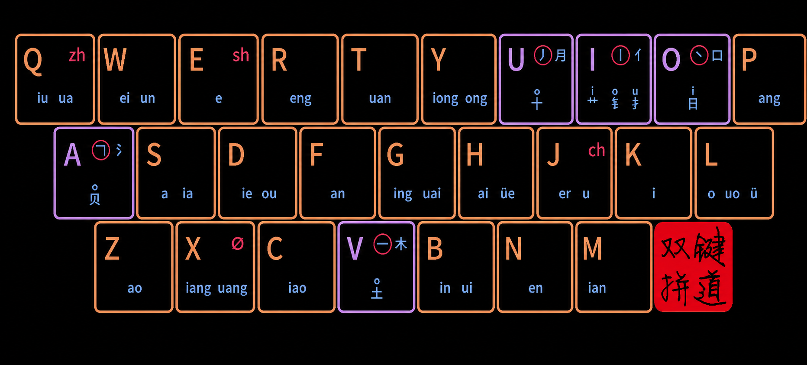

# 键道6·无飞键版说明（J/Q 方案）

本分支采用固定、唯一的无飞键规则：

- **ch → J**：所有 `ch` 声母都用 J，不再使用 W。
- **zh → Q**：所有 `zh` 声母都用 Q，不再使用 F。
- **uang → X**：所有 `uang` 韵母都用 X，不再使用 M。

这里的“固定”只针对编码中的**声母或韵母位置**，不是把词库里的字母全局替换。例如 J 在声母位仍然可以表示原生声母 `j`，在韵母位仍然表示 `er、u`。

## 无飞键版键盘图



相较原飞键图，本图只取消了三处备用分配：W 上的 `ch`、F 上的 `zh`、M 上的 `uang`。J 上的 `ch`、Q 上的 `zh`、X 上的 `uang` 保留为唯一分配。

## 完整键位表

同一个键可以在不同编码位置承担声母、韵母或形码功能，表中各列不能互相混用。

| 键 | 原生声母 | 固定/特殊声母 | 韵母 | 备注 |
| --- | --- | --- | --- | --- |
| Q | q | **zh** | iu、ua | `zh` 的唯一声母键 |
| W | w | — | ei、un | 不再表示 `ch` |
| E | — | sh | e | 原方案不变 |
| R | r | — | eng | 原方案不变 |
| T | t | — | uan | 原方案不变 |
| Y | y | — | iong、ong | 原方案不变 |
| U | — | — | — | 方案功能/形码键，保持原图定义 |
| I | — | — | — | 方案功能/形码键，保持原图定义 |
| O | — | — | — | 方案功能/形码键，保持原图定义 |
| P | p | — | ang | 原方案不变 |
| A | — | — | — | 方案功能/形码键，保持原图定义 |
| S | s | — | a、ia | 原方案不变 |
| D | d | — | ie、ou | 原方案不变 |
| F | f | — | an | 不再表示 `zh` |
| G | g | — | ing、uai | 原方案不变 |
| H | h | — | ai、üe | 原方案不变 |
| J | j | **ch** | er、u | `ch` 的唯一声母键 |
| K | k | — | i | 原方案不变 |
| L | l | — | o、uo、ü | 原方案不变 |
| Z | z | — | ao | 原方案不变 |
| X | x | Ø（零声母） | iang、uang | `uang` 的唯一韵母键 |
| C | c | — | iao | 原方案不变 |
| V | — | — | — | 方案功能/形码键，保持原图定义 |
| B | b | — | in、ui | 原方案不变 |
| N | n | — | en | 原方案不变 |
| M | m | — | ian | 不再表示 `uang` |

## Q、W、F、J、X、M 快速记忆

- **Q：zh**；同时保留原生声母 `q` 和韵母 `iu、ua`。
- **W：ei、un**；声母位只表示原生 `w`，不再表示 `ch`。
- **F：an**；声母位只表示原生 `f`，不再表示 `zh`。
- **J：ch；er、u**；声母位可以表示 `j` 或固定的 `ch`。
- **X：iang、uang**；同时保留原生 `x` 和零声母功能。
- **M：ian**；声母位仍表示原生 `m`，不再表示 `uang`。

可以记成一句话：**“翘舌 ch 回 J，zh 回 Q，uang 回 X；W、F、M 只留本职。”**

## 输入示例

### 已统一的编码

- 超 `jz`：`ch + ao`，因此声母固定用 J。
- 春 `jwv`：`ch + un`，原 W 飞键形式已取消。
- 穿 `jt`：`ch + uan`，原 W 飞键形式已取消。
- 找 `qz`：`zh + ao`，声母固定用 Q。
- 中 `qy`：`zh + ong`，声母固定用 Q。
- 装 `qx`：`zh + uang`，声母用 Q，`uang` 用 X。
- 光 `gx`：`g + uang`，`uang` 固定用 X。

### 必须保持的原生编码

- 均 `jw`：声母是原生 `j`，不是 `ch`。
- 无 `wj`：声母是原生 `w`，不是飞键。
- 求 `qq`：声母是原生 `q`，不是 `zh`。
- 服 `fj`：声母是原生 `f`，不是飞键。

因为取消飞键后两个声母可能共用同一按键，二键音码会出现合理重码。例如春 `chun` 与均 `jun` 都以 `jw` 开头，后续形码和候选顺序继续负责区分。这是用“固定规则、容易记忆”交换部分音码区分度的结果。

## 与原飞键版的区别

| 项目 | 原飞键版 | 本无飞键版 |
| --- | --- | --- |
| ch | 根据音节分布在 J/W | 全部固定到 J |
| zh | 根据音节分布在 Q/F | 全部固定到 Q |
| uang | 根据音节分布在 X/M | 全部固定到 X |
| 记忆方式 | 需要记住哪些音节发生飞键 | 只记 J/Q/X 三条固定规则 |
| 二键音码区分度 | 分流后重码较少 | 部分音码重合，但规则统一 |
| 形码、简码、候选顺序 | 原方案规则 | 尽量原样保留 |

## 改成无飞键版时具体做了什么

### 1. 只转换音码位置，没有全局替换字母

转换程序先判断词条类型和编码结构，再修改明确的声母或韵母槽位：

- 单字：声母、韵母，后面是零个或多个形码。
- 二字词：两个完整音码，后面继续保留形码。
- 三字词：前三个字的声母，后面继续保留形码。
- 四字及以上词：前三字声母加末字声母，后面继续保留形码。
- WXW/SSB 类词表：只把第一个规定位置当作声母处理。
- `xmjd6.cx` 的 `o` 前缀：保留前缀，只转换其后的音码。

因此原生的 `j、q、w、f、x、m`、形码字母和自定义快捷码不会被误改。

### 2. 结合读音判断多音字和特殊词条

转换时按以下顺序解析读音：

1. 使用词条已有的拼音注释。
2. 使用上下文拼音判断多音词中的实际读音。
3. 根据原编码声韵前缀筛选匹配读音。
4. 使用 `xmjd6.cx.dict.yaml` 建立生僻字读音索引。
5. 对无法由通用规则可靠判断的少量条目使用显式覆盖表。

标准词条如果仍不能确定，不会静默猜测，而是让构建失败并进入报告。本次构建的**未解决条目：0**。

### 3. 保留原词库信息和候选顺序

转换过程保留：

- 形码后缀；
- 权重、注释和其他制表符字段；
- YAML 头部、BOM 和原有换行风格；
- 不同候选之间的原始相对顺序。

当原来的两条飞键记录在统一后变成完全相同的“文字＋编码”时，只保留先出现的一条。不同文字即使得到相同编码，也不会被错误删除。

### 4. 不属于标准音码的内容不强行转换

符号、链接、英文、自定义快捷码等非音码表保持原样复制。`xkjd6.yinyang`、`xkjd6.wanne` 等特殊表按其实际格式复制或单独分类；不会拿普通单字规则硬套。

### 5. 分支根目录就是可运行方案

`feature/xmjd6-nofly` 分支已经把无飞键运行文件放在仓库根目录，不再保留第二层 `xmjd6-nofly/` 目录。直接切换分支并重新部署即可，不需要复制到另一个 Rime 目录，也不设计为与飞键版同时启用。

Windows 优先使用 `default_win.yaml` 和 `default.custom_win.yaml` 生成的默认配置，并保留小狼毫配置、Lua、OpenCC、字体及反查依赖。构建产物不包含用户数据库、本机状态文件或旧的 `build/*.bin`。

## 本次 J/Q/X 版转换统计

统计来自根目录的 `conversion-report.txt`：

| 项目 | 数量 |
| --- | ---: |
| 输入词条 | 1,259,654 |
| 输出词条 | 1,251,651 |
| 实际转换 | 168,381 |
| 合并重复 | 8,003 |
| 未解决条目 | 0 |

## 如何测试

### Windows（小狼毫，优先）

如果仓库根目录就是 `%APPDATA%\Rime`，在 PowerShell 中执行：

```powershell
cd $env:APPDATA\Rime
git checkout feature/xmjd6-nofly
```

然后：

1. 在小狼毫托盘菜单中选择**重新部署**。
2. 选择方案“**键道6·无飞键版**”。
3. 依次测试 `jz → 超`、`jwv → 春`、`jt → 穿`、`qz → 找`、`qy → 中`、`qx → 装`、`gx → 光`。
4. 确认另一组飞键形式 `wz、wwv、wt、fz、fy、fm、gm` 不再以原方式提供这些字。
5. 再测试原生编码 `jw → 均`、`wj → 无`、`qq → 求`、`fj → 服` 仍可用。

每次切换 `main` 与 `feature/xmjd6-nofly` 后都必须重新部署，因为旧的编译文件可能仍留在 `build/` 中。

### macOS（鼠须管）

```bash
cd ~/Library/Rime
git checkout feature/xmjd6-nofly
"/Library/Input Methods/Squirrel.app/Contents/MacOS/rime_deployer" --build \
  ~/Library/Rime \
  "/Library/Input Methods/Squirrel.app/Contents/SharedSupport"
```

随后按照 Windows 部分的示例码逐项实际输入验证即可。

### 维护者自动测试

```bash
python3 tests/test_nofly_guide.py
python3 tests/test_nofly_bundle.py
python3 tests/test_nofly_root_layout.py
```

这三组测试分别检查文档与键盘图、转换程序与打包内容、以及当前分支根目录中的真实编码。
